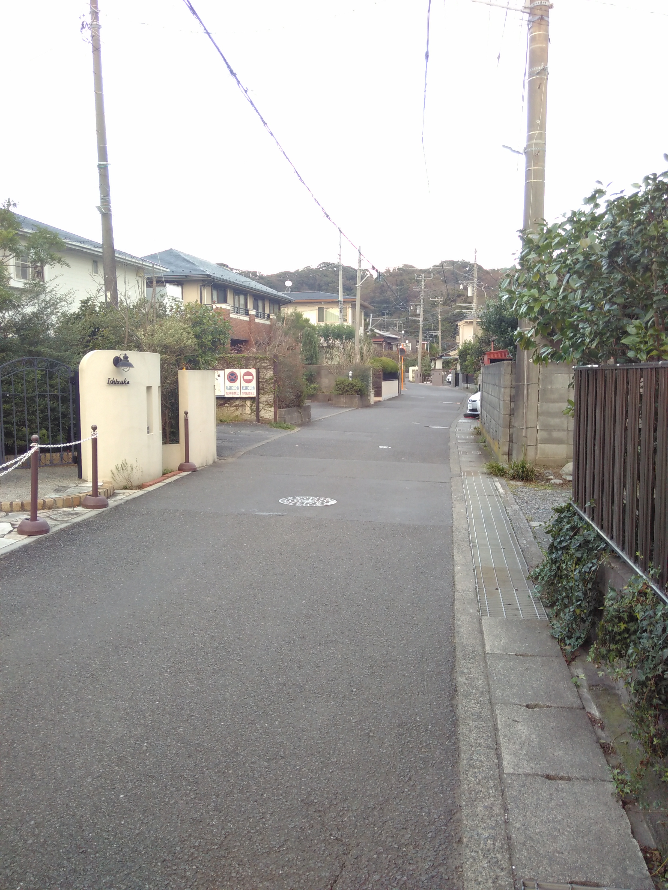

Als erstes habe ich in Kamakura einen Tempel besichtigt, dessen Namen ich nicht mehr weiß. Aber er war sehr hübsch :D. Das obere Bild stammt vom weitläufigen 
Gelände des Tempels. 

First I visited a temple in Kamakura, whose name I don't know anymore. But it was very pretty :D. The picture above is from the extensive area of the temple. 

最初に、鎌倉の寺院を訪れましたが、その名前はもう分かりません。きれいでした :D。上の写真は寺院の一部です。

Natürlich habe ich mir auch den Großen Buddha von Kamakura im <a href="https://www.kotoku-in.jp/en/" target="_blank" rel="noopener noreferrer">Kōtoku-in 
</a> angeschaut. Besonders interessant ist, dass man für 200 Yen in ihn hinein gehen kann; die Statue ist innen hohl. Warum das so ist, hab' ich allerdings 
nicht herausbekommen. 
Danach habe ich noch den wunderschönen <a href="https://www.hasedera.jp/en/" target="_blank" rel="noopener noreferrer">Hase-Dera-Tempel</a> besucht, von dem 
man einen tollen Blick über Kamakura hat. Und anschließend habe ich noch einige Zeit am Strand verbracht.

Of course I also had a look at the Great Buddha of Kamakura at <a href="https://www.kotoku-in.jp/en/" target="_blank" rel="noopener noreferrer">Kōtoku-in </a>.
Especially interesting is that you can go into the Buddha for 200 yen; the statue is hollow. Didn't found out why.
Afterwards I visited the beautiful <a href="https://www.hasedera.jp/en/" target="_blank" rel="noopener noreferrer">Hase-Dera-Tempel</a>, 
from which you have a great view over Kamakura. And finally, I spent some time at the beach.

もちろん、高徳院の鎌倉の大仏も見ました。特に興味深いのは、200円で仏に入ることができるということです。彫像は中空です。理由がわかりませんでした。
長谷寺を訪れました。海岸に行きました。

Viele Straßen in Kamakura sind sehr schmal. Es gibt meist keinen Bürgersteig, so wie wir ihn kennen. Zudem teilen sich Radfahrer und Fußgänger den Weg. Oft ist
 er nur so breit wie eine Person und auch nur gringfügig gekennzeichnet. Es scheint als hätten Fußgängerkeinen großen Stellenwert :D.

Many roads in Kamakura are very narrow. There is usually no sidewalk as we know it. In addition, cyclists and pedestrians share the way. Often it is only as 
wide as a person and only slightly marked. It seems pedestrians aren't very important :D.

鎌倉の多くの道路は狭いです。歩道はありません。歩行者とサイクリストが道を共有します。道は人と同じくらい広いです。
