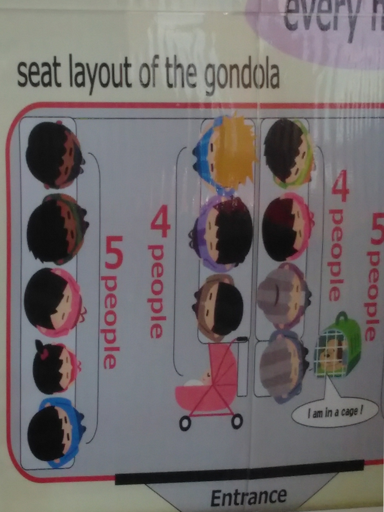
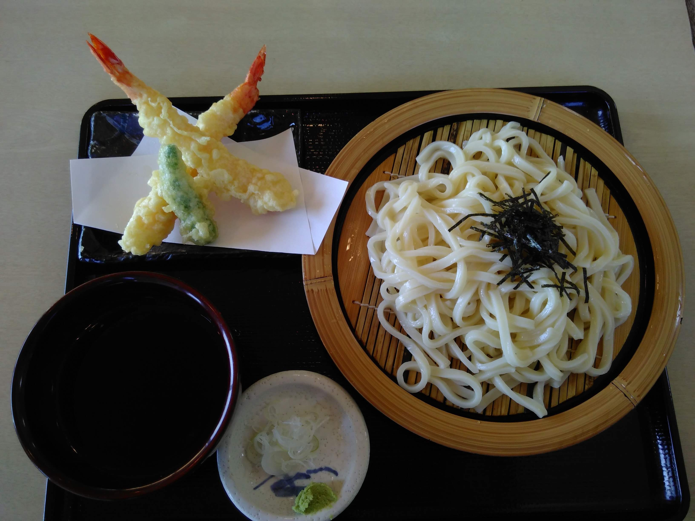

Das volle Touristenprogramm gab's heute. Nachdem ich gestern so einen schönen Blick auf den Fuji-san hatte und der Wetterbericht sehr gute Sicht und 
Sonnenschein prognostizierte, bin ich noch einmal an den Ashi-See gefahren.  
Als erstes ging es zum Hakone Checkpoint. Hakone gehörte während der Edo-Zeit zu einem der 53 Stationen der Tōkaidō-Handelsstraße und durch die Rekonstruktion 
des Checkpoints bekommt man einen guten Einblick der damaligen Lebensumstände.  
Im Übrigen gibt es von Hiroshige auch Farbholzschnitte, die die 
<a href="https://en.wikipedia.org/wiki/The_Fifty-three_Stations_of_the_T%C5%8Dkaid%C5%8D" target="_blank" rel="noopener noreferrer">53 Stationen
</a>darstellen und absolut schön sind. Hakone ist Station Nummer 10; auf dem Bild erkennt man unten rechts sehr gut, wie steil der Weg verläuft 😋.

Mit Piratenschiffen kann man sich über den See schippern lassen und die Aussicht genießen. Bei dem Wetter heute war der Fuji sehr schön zu sehen. Inzwischen 
bin ich auch am Überlegen, ob ich meine Reiseplanung etwas umwerfe und anstatt zwei der schönsten Gärten Japans lieber das Gebiet der fünf Fuji-Seen besuche. 
Da ist dann sicherlich auch ein Close-Up drin 😳. Ich glaube ich bin etwas besessen vom Fuji - aber er ist einfach so atemberaubend schön! Bitte helft mir bei 
der Entscheidungsfindung 😩.

Today I enjoyed the full tourist program. After I had such a nice view of the Fuji-san yesterday and the weather forecast predicted very good view and sunshine, 
I once again went to Lake Ashi.  
First I went to the Hakone Checkpoint. During the Edo period Hakone belonged to one of the 53 stations on the Tōkaidō trade route and by reconstruction of the 
checkpoint one gets a good insight into the living conditions at that time.  
By the way, there are also colored woodblock prints by Hiroshige, which represent the 
<a href="https://en.wikipedia.org/wiki/The_Fifty-three_Stations_of_the_T%C5%8Dkaid%C5%8D" target="_blank" rel="noopener noreferrer">53 stations 
</a> and are absolutely beautiful. Hakone is station number 10; on the picture in the lower right corner you can see very well how steep the path is 😋.

With pirate ships you can sail over the lake and enjoy the view. The weather today made the Fuji look very nice. Meanwhile, I am also thinking about whether I 
should change my travel plans a bit and instead of visiting two of the most beautiful gardens in Japan, to visit the area of ​​the Fuji Five Lakes. Certainly 
there is a close-up possible 😳. I think I'm a bit obsessed with Fuji - but he's just so breathtakingly beautiful! Please help me with the decision 😩.

Nach der Schifffahrt kann man weiter mit den Seilbahnen die Gegend erkunden und hat eine wirklich grandiose Sicht auf die Landschaft. Außerdem erhascht man einen Blick auf Quellen mit heißem Schwefelwasser (das man auch riecht), in dem sogenannte Onsen-Tamago (Onsen = heiße Quelle, Tamago = Ei) gekocht werden. In Hakone sind die schwarzen Onsen-Tamago eine Spezialität. 
Eine sehr wichtige Information: In den Seilbahnen dürfen Hunde mitfahren!

After the boat trip you can explore the area with the cable cars and have a really magnificent view of the landscape. You can also catch a glimpse of springs 
with hot sulfur water (which you can also smell) in which so-called Onsen-Tamago (Onsen = hot spring, Tamago = egg) are cooked. In Hakone the black Onsen-Tamago
 are a specialty. 
A very important information: Dogs are allowed in cable cars!

Da mein Kamera-Akku heute schon sehr zeitig leer war, gibt es nur wenige Bilder-Variationen (hauptsächlich Fuji :D). 
Deswegen hier mal ein Bild vom Essen 😋. Oh, und zum Nachtisch gab es Macha-Eis - superlecker 😍.

Since my camera battery was already empty very early today, there are only a few image variations (mainly Fuji :D). So here's a picture of the food 😋. 
Oh, and for dessert I had Macha ice cream - super delicious 😍.

