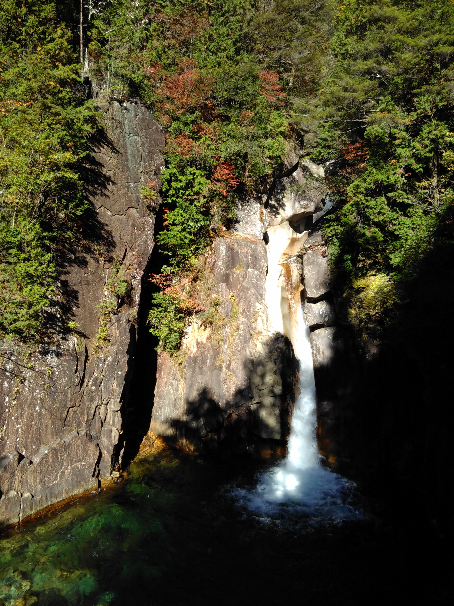

Das Cover-Bild von gestern zeigt den Ausblick von der Terasse des Hostels. Ein Grund, warum ich sehr gerne noch dort geblieben wäre. Da aber für die nächsten 
Wochen alles ausgebucht ist, hat mich Rey, die Besitzerin des Hostels, als Entschädigung zu einem versteckten Wasserfall in den Bergen geführt. 
Im Sommer kann man im Fluss baden, das Wasser ist trinkbar und so klar 😊.

The cover image of yesterday shows the view from the terrace of the hostel. One reason why I would have loved to stay there a bit longer. But since everything 
is booked for the next few weeks, Rey, the owner of the hostel, took me to a hidden waterfall in the mountains as compensation. In summer you can swim in the 
river, the water is drinkable and so clear 😍. 

In Kyōto war ich dann etwas überfordert, weil es einfach so viele Menschen hier gibt. Aber mein Hostel liegt in Gion und damit in der Nähe vieler 
Sehenswürdigkeiten.
Abends habe ich mich mit Hidaka-san und seinem Freund getroffen. Hidaka-san ist Japaner und hat eine zeitlang in Kiel gewohnt. Wir waren Sushi essen, 
was außerordentlich lecker war :D. Wir haben uns dreisprachig unterhalten, auch ziemlich witzig ^^.

In Kyōto, I was a bit overwhelmed, because there are just so many people here. But my hostel is located in Gion and therefore close to many attractions.
In the evening I met with Hidaka-san and his friend. Hidaka-san is Japanese and lived in Kiel for a while. We went to eat Sushi, which was extremely tasty :D. 
We talked in three different languages, what was kind of funny ^^.

