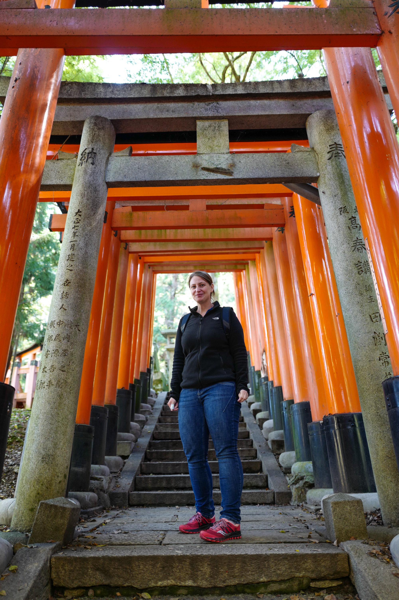
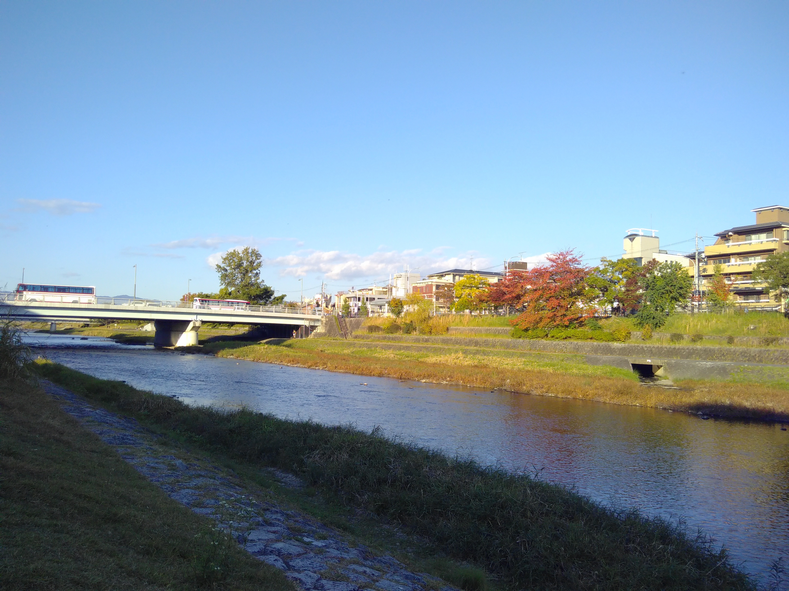

Ihr solltet nicht an den Schreinen lecken, denn die Farbe, das Zinnoberrot (Shu-iro, 朱色), ist ein Quecksilbersulfid! Für die neu lackierten Elemente gilt das 
nicht, aber kann man immer genau wissen, was neu ist? ^^  
Heute habe ich diese <a href="https://crafttabby.com/alternative-fushimi-inari-walking-tour" target="_blank" rel="noopener noreferrer">geführte Tour von 
Craft Tabby </a> zum Fushimi Inari Schrein mitgemacht und es war außerordentlich interessant und wirklich spektakulär. Mehr Wissenswertes und Spannendes kann 
man weder allein noch mit einer gewöhnlichen Tour erfahren.  
Wir waren eine kleine Gruppe von 6 Leuten (inkl. Guide) und haben uns die meiste Zeit abseits der Touristenpfade aufgehalten. Wir konnten etliche Fragen 
stellen, haben das Zweimal-Klatschen-Zweimal-Verbeugen-Ritual kennengelernt, mit Bäumen geredet, heiliges Wasser getrunken, Überreste von buddistischen Tempeln
 und Schreinen gesehen, erfahren, wie Buddhismus und Shintoismus zunächst zusammengeführt, dann aus politischen Gründen wieder getrennt wurden und welchen 
 Einfluss der Fushimi Inari Schrein auf Nintendo hat, haben private Schreine besucht, uns einen Zen-Garten und verschiedene Pflanzen der Umgebung angeschaut, 
 über Drachen und Füchse geredet, einen Gott gebeten unsere Augen zu heilen und natürlich, was wohl jeder Fushimi-Inari-Besucher macht, die Torii und den 
 wunderbaren Ausblick über Kyōto genossen 😋.
Falls ihr einmal in Kyōto seid und ihr, so wie ich, Geschichten liebt und gerne Zusammenhänge und das 'große Ganze' verstehen möchtet, kann ich diese Tour nur 
wärmstens empfehlen!  
Ich würde gerne noch so viel über die Geschichten und die Hintergründe schreiben, z.B. über den Zen-Garten des Komyo-in Tempels, aber das würde den Rahmen 
sprengen 🙃.

Eine Sache, die ich besonders schön fand war ein Gedicht, das wir bei Frau Hitori, der Dame, die sich um die Pflege des Ganrikisha (Schrein für das Heilen der 
Augen) kümmert, gesehen haben. Es heißt 'A Dream', bzw. 'Ein Traum' und ich versuche es ins Deutsche zu übersetzen. Der japanische Text, der Text in 
Rōmaji (Umschrift in das lateinische Alphabet) und der englische Text sind von 
<a href="https://crafttabby.com/explore/ganrikisha" target="_blank" rel="noopener noreferrer">dieser Seite </a> kopiert: 

夢  
Yume  
A Dream  
Ein Traum  

夢あるものは　希望がある  
Yume aru mono ha kibō ga aru  
A person with a dream is a person with hope  
Ein Mensch mit einem Traum ist ein Mensch mit Hoffnung  

希望あるものは　目標がある  
Kibō aru mono ha mokuhyō ga aru  
A person with hope is a person with an aim  
Ein Mensch mit Hoffnung ist ein Mensch mit einem Ziel  

目標あるものは　計画がある  
Mokuhyō aru mono ha keikaku ga aru  
A person with an aim is a person with a plan  
Ein Mensch mit einem Ziel ist ein Mensch mit einem Plan  

計画あるものは　行動がある  
Keikaku aru mono ha kōdō ga aru  
A person with a plan is a person with action  
Ein Mensch mit einem Plan ist ein Mensch mit Handlung  

行動あるものは　実績がある  
Kōdō aru mono ha jisseki ga aru  
A person with action is a person with results  
Ein Mensch mit Handlung ist ein Mensch mit Ergebnissen  

実績あるものは　反省がある  
Jisseki ga aru mono ha hansei ga aru  
A person with results is a person with reflection  
Ein Mensch mit Ergebnissen ist ein Mensch mit Reflektion  

反省あるものは　進歩がある  
Hansei ga aru mono ha shinpo ga aru  
A person with reflection is a person with improvement  
Ein Mensch mit Reflektion ist ein Mensch mit Verbesserung  

進歩あるものは　夢がある  
Shinpo ga aru mono ha yume ga aru  
A person with improvement is a person with a dream  
Ein Mensch mit Verbesserung ist ein Mensch mit einem Traum  

眼力社　稲荷山  
Ganrikisha, Inariyama (Mt. Inari)  

Es ist so schön, weil es einen Kreislauf darstellt 🥹.  

Am Ende der Tour waren wir Ramen essen und ich habe später noch am Ufer des Kamo gesessen.

