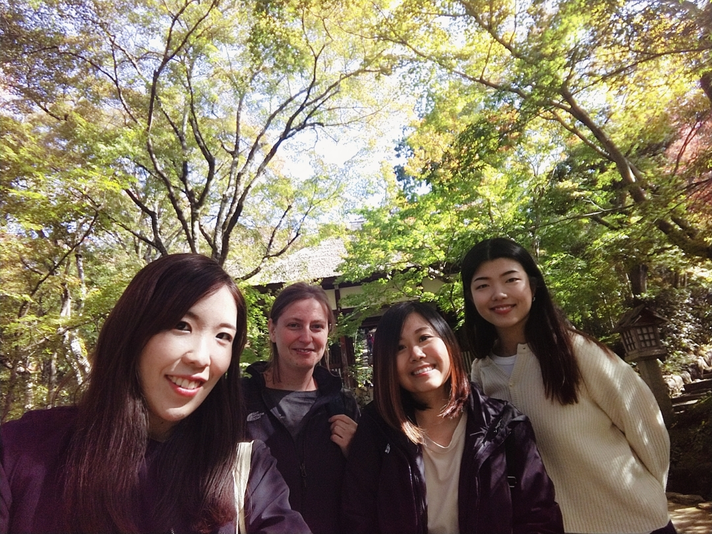
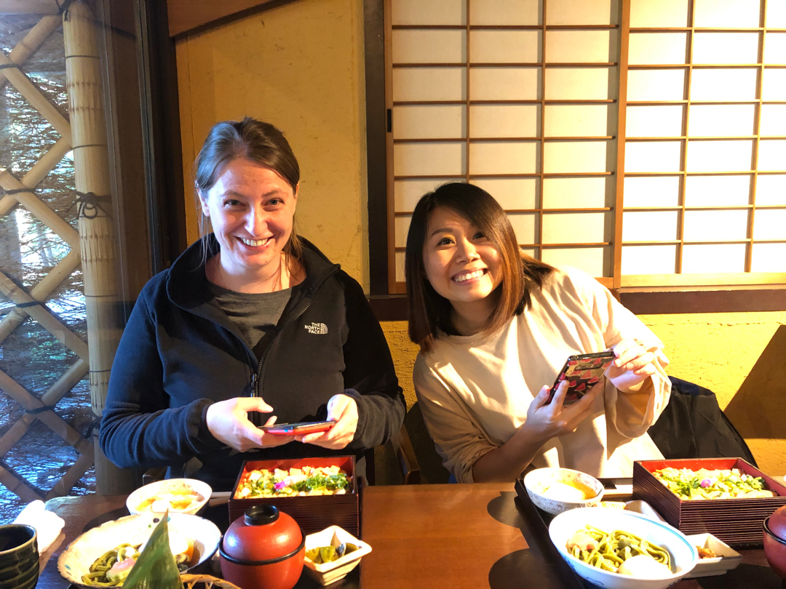
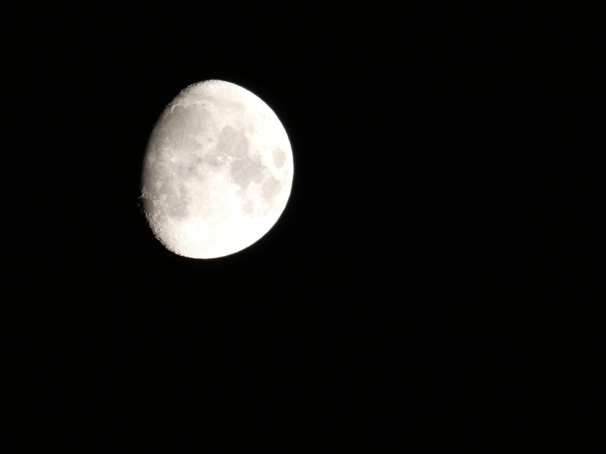

Heute habe ich eine geführte Tour, auch wieder größtenteils abseits der Touristenpfade, zum Arashiyama Bambuswald gemacht. Es war eine sehr private Tour, weil 
wir zu viert waren: zwei Touris, zwei Guides :D.  
Sie ist nicht zu vergleichen mit der Tour zum Fushiri Inari, weil das vermittelte Wissen nicht im Ansatz so intensiv war wie bei Lee, aber unsere 
Vierer-Mädels-Truppe war super witzig ^^.

Wir haben uns einige Tempel und Gärten im Stadtteil Arashiyama angeschaut, die wenig überlaufen und wirklich wunderschön waren. 

Wir hatten zudem auch einen schönen Blick auf Kyōto.

Und schließlich sind wir im Bambuswald angekommen. Wobei ich ehrlich sagen muss, dass ich ihn mir komplett anders vorgestellt habe. Er ist sehr unspektakulär 
dafür, dass er so gehyped wird. Zum einen ist es nur eine recht kurze Strecke, die man durch den Wald geht, zum anderen sind dort so viele Menschen unterwegs, 
dass man weder die Umgebung genießen, noch ein anständiges Bild machen kann. Da empfehle ich als Alternative unbedingt den Bambuswald in Kamakura 😋.  

Danach waren wir noch in einem sehr schicken Restaurant essen. Und da Kyōto an drei Seiten von Bergen umgeben ist und dadurch über viele reine Quellen verfügt,
 bekommt man hier sehr guten Tofu. Unser Essen bestand aus sehr viel Tofu :D und war super lecker. Hier auf dem Bild empfehle ich übrigens auch gerade den 
 Kamakura Bambuswald 😋.

Da ich mich von Kyōto etwas überfordert fühle gibt es eine kleine Planänderung. Die beiden Kanadier, die ich in Nagiso kennengelernt habe, hatten das Feuerfest
 in Sakugawa, nahe Fukushima, angepriesen und da werde ich spontan hinfahren.  
Da es einige Stunden Fahrt sind (rund 4,5 Stunden, mit dem JR Pass zahle ich aber nichts) und ich keine Lust habe, meinen Koffer mitzuschleppen, lasse ich ihn 
nach Kanazawa vorschicken. Mal sehen wie das funktioniert :D. 

Abends war ich wieder spazieren und die Straßen hier sind so krass beleuchtet, dass es wirkt wie ein riesiger Weihnachtsmarkt (es läuft in vielen Geschäften 
auch schon Weihnachtsmusik ^^). Es gibt ewig lange, überdachte Einkausstraßen, in denen man wirklich alles kaufen kann. Ich stelle es mir unendlich spaßig vor, hier mit Lottchen rumzuschlendern :D. 

Und der Mond sah wieder mal sehr schick aus 😍.

