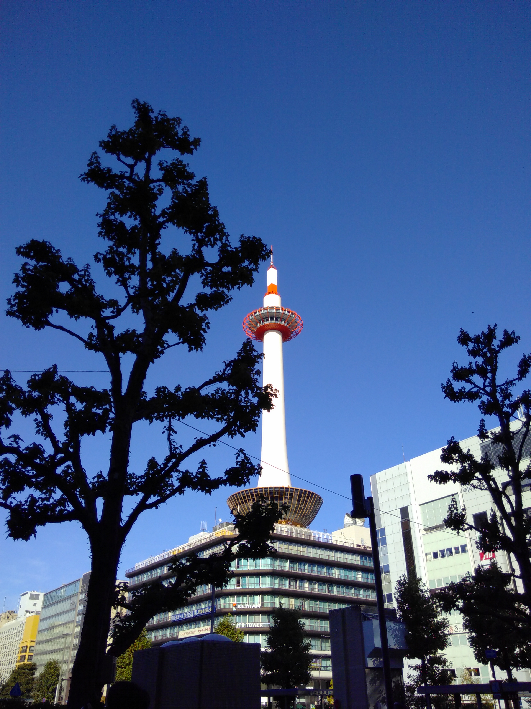

Das Sukagawa Taimatsu Akashi ist ein Feuerfest mit einer 420-jährigen Geschichte. Es soll entstanden sein, als die Bewohner Sukagawas zum ersten Mal das Leben der vielen Menschen betrauerten, die während des Angriffs eines Feudalherren auf die Burg Sukagawas im Jahr 1589 starben. 

Am Tag des Festivals wird eine riesige Fackel mit einer Länge von 10 Metern und einem Gewicht von 3 Tonnen von rund 150 kräftigen einheimischen Jugendlichen bis zum Berg Goro durch die Stadt getragen. Am Abend, ca. 17:30 Uhr wird diese und dann weitere, rund 30 massive Fackeln nach und nach entzündet. Begleitet wird das sehr beeindruckende Szenario von Trommlern, sodass einem beim Anblick und Zuhören der Atem stockt. Sehr eindrucksvoll :).  
Von mir gibt es dazu leider keine guten Bilder, deswegen verlinke ich  <a href="https://ohmatsuri.com/en/articles/fukushima-sukagawa-taimatsu-akashi" target="_blank" rel="noopener noreferrer">hier</a> eine Seite. <a href="https://guides-japan.com/event_spots/detail/3385/Nov_19%2C_2019_____Sukagawa_Taimatsu_Akashi" target="_blank" rel="noopener noreferrer">Und hier </a>hier kann man sich ein Video von diesem Jahr anschauen. 

Der Weg zum Berg hoch war mit Feuerschalen geschmückt und verschiedene Elemente waren schick beleuchtet. 

Sehr interessant zu beobachten war, wie die Menschen das Fest gefeiert und sich verhalten haben. Es war alles sehr gut organisiert, die Menschen sind respektvoll und rücksichtsvoll miteinander umgegangen. Es wirkte wie ein Familienfest. Nirgendwo habe ich 'Bierbuden' oder Menschen mit Alkohol rumlaufen gesehen. Wobei es viele Stände mit Süßigkeiten und anderem Essen gab ^^. Sicherlich wird auch ordentlich gefeiert worden sein, aber dann erst später, als der gefährliche Part vorbei war :D.

By the way: Auf dem Weg zum Bahnhof heute Morgen bin ich am Kyōto Tower vorbei gekommen ^^. 

