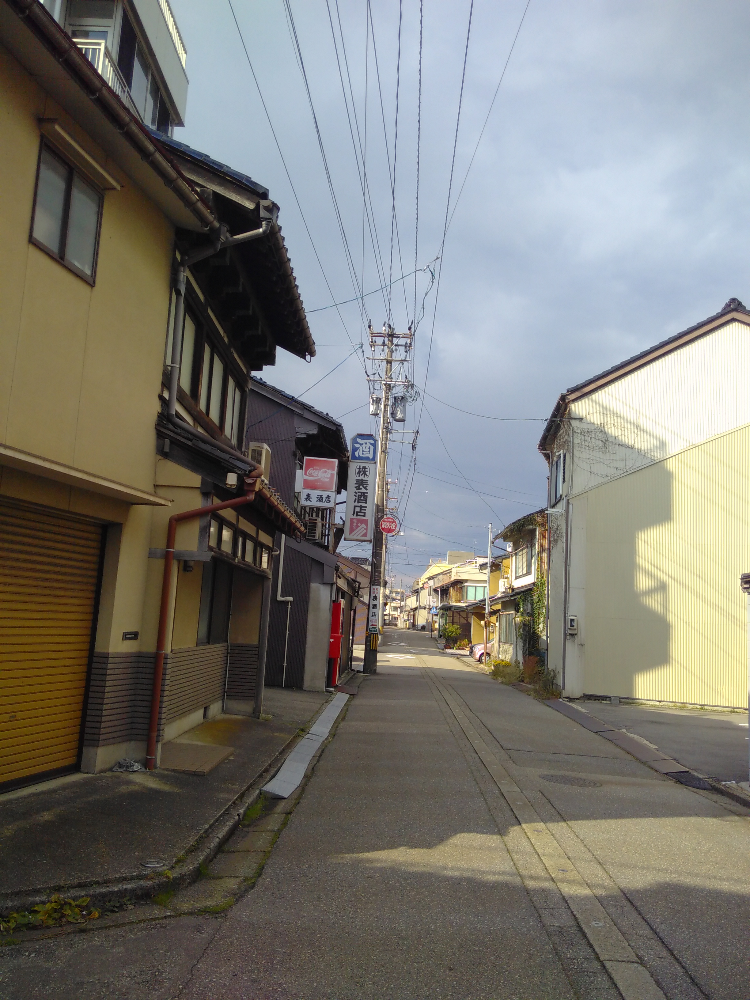

Seit dem frühen Nachmittag gewittert und schüttet es hier. Richtig heftig sogar ^^. Was aber sehr gemütlich ist, denn ich sitze in meinem Zimmer in Decken 
gewickelt und trinke Tee :D.

Heute Morgen war ich noch unterwegs und habe Kanazawa erkundet, bin aber in den uninteressanteren Ecken gelandet. Sowas passiert manchmal, wenn man einfach 
drauflos läuft :D. Wobei ich eine Pause in einem kleinen, hübschen Park gemacht habe.    
Der Bahnhof Kanazawas ist architektonisch sehr interessant, davon muss ich die Tage mal noch Bilder machen. Außerdem sieht man in der Stadt verstreut immer 
wieder einzelne Kunstwerke, was wohl mit dem sich hier befindenden Museum für zeitgenössische Kunst des 21. Jahrhunderts in Zusammenhang steht ^^. Da werde 
ich auch noch mal vorbei schauen. 

Da es die kommenden beiden Tage ebenfalls regnen soll, werde ich einen Abstecher nach Ōsaka machen und mir die Street-Food-Gegend anschauen :D.