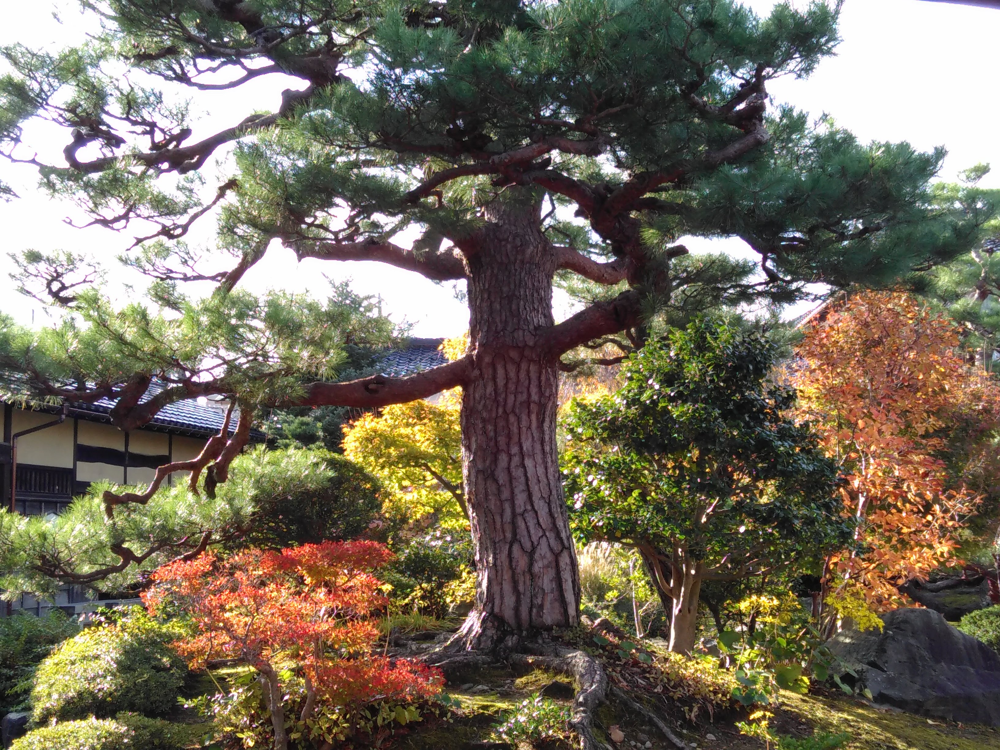
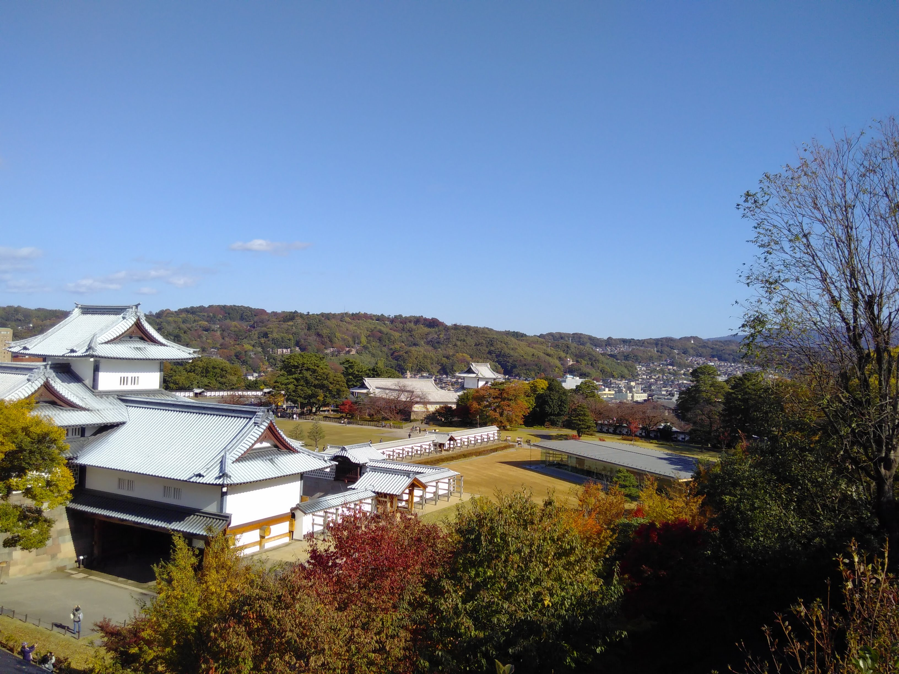
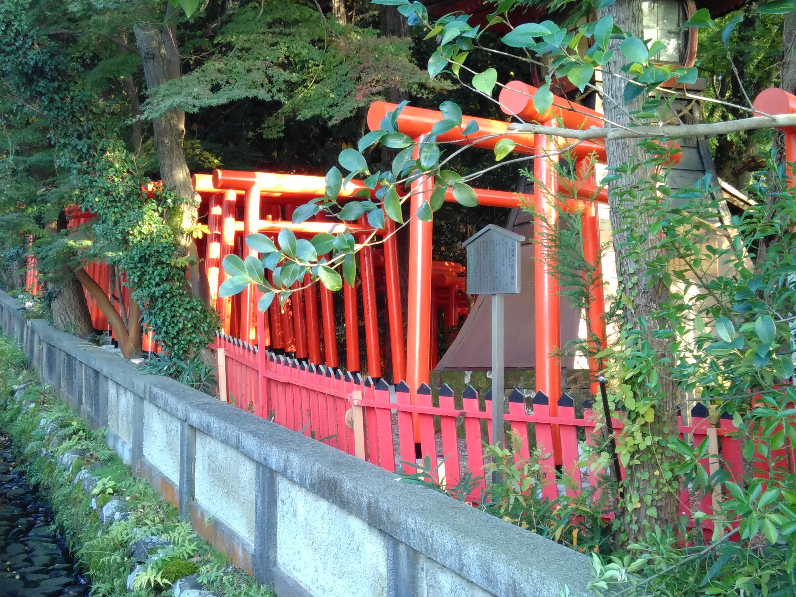
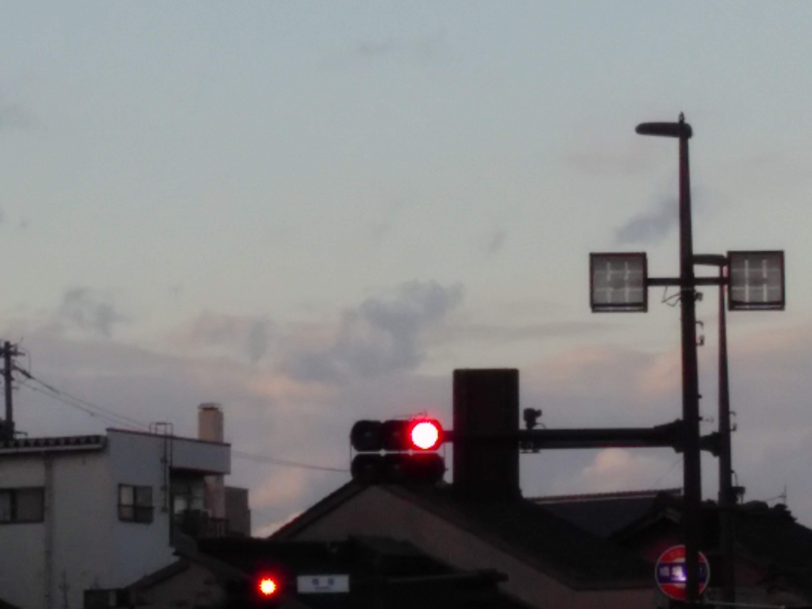

In Kanazawa gibt es auch ein altes Samurai-Viertel. Hier kann man sich Samurai-Residenzen aus der Edo-Zeit anschauen. Das ist sehr interessant, da es drei öffentlich zugängliche Villen von Familien mit unterschiedlichen Samurai-Rängen zu bestaunen gibt.  
Alle haben selbstverständlich mindestens einen kleinen Garten :P.

Danach habe ich den Nachmittag im Schlossgarten verbracht, die wunderhübschen Herbstfarben bewundert und mich langsam, sehr langsam begonnen mich zu verabschieden.

Gestern hatte ich geschrieben, dass Kanazawa auch als Klein-Kyōto bezeichnet wird. Auch hier gibt es einen Gang aus Torii ^^. 

Was aber noch viel schöner ist, ist die Aufschrift auf einem Pfeiler daneben: "May peace revel on earth".

Und hier kommt noch ein kleines Rätsel: Was seht ihr auf dem foldenden Bild über der Ampel? Was bilden die Wolken? :D

