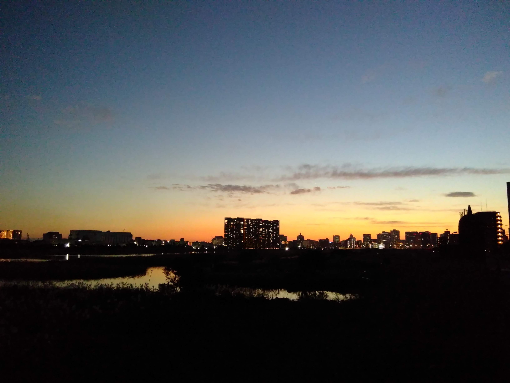
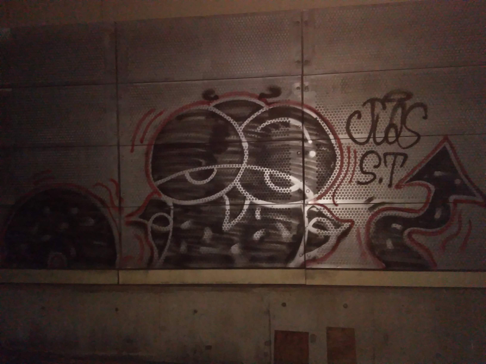

So, der letzte Tag in Japan war etwas anstrengend. Der Shinkansen von Kanazawa nach Tōkyō fuhr super und pünktlich durch. In Tōkyō ist dann ein Zug ausgefallen und ich habe ungelogen drei Stunden und fünf Umstiege bis zum Kapselhotel benötigt. Aber so musste ich zumindest nicht die Zeit bis zum Check-In totschlagen :D.

Der Abend war dann aber besonders schön, weil der Fuji-san mich noch mit einem atemberaubenden Sonnenuntergang verabschiedet hat ^^. Die Bilder sind leider nicht sehr spektakulär, weil ich spazieren war und nur mein Handy mit hatte. In Real war es aber tatsächlich wunderschön, was natürlich auch zu etwas Herzschmerz führte ;). 

Und ich habe die ersten beiden Graffitis in Japan an diesem Abend gesehen. Graffitis scheinen sehr selten zu sein.  

Die Tage werde ich nochmal ein Résumé zur Reise mit meinen Erkenntnissen, Learnings und ToDos für die nächste Reise schreiben :). 

