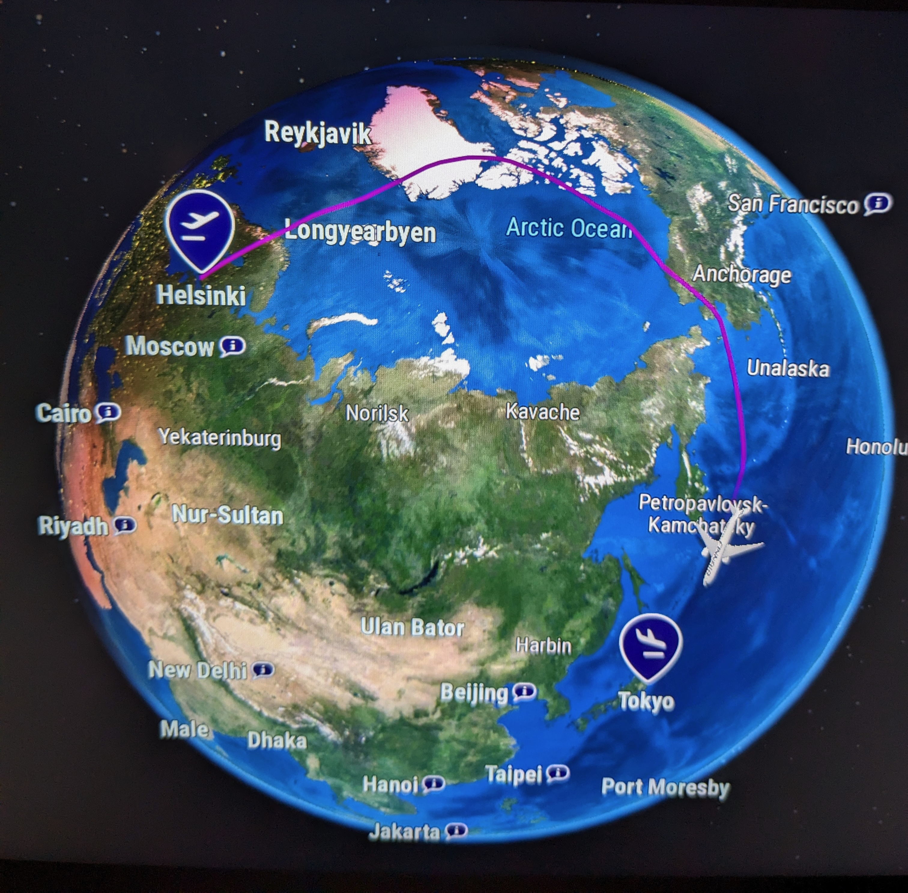

Nachdem die Sachen gepackt, die Unterkünfte gebucht und Pläne geschmiedet waren, ging die Reise mittags am 10.05. von Berlin über Helsinki und nach Tōkyō Narita. Dieses Mal flogen wir nicht, wie vor 4,5 Jahren, über Russland, sondern nördlich um Russland drumherum, weswegen die meiste Zeit außer Sonnenlicht reflektierendes Weiß oder Wasser nicht viel zu sehen war und es auch keine richtige Nacht gab.

Der Flug von Helsinki war aufgrund der Wetterlage etwas verspätet; in Tōkyō Narita sind wir trotzdem pünktlich angekommen. Bis alles für die Weiterfahrt mit dem Bus nach Fujikawaguchiko geklärt war, war es schon später Nachmittag. Die Fahrt war aufgeteilt in zwei Abschnitte (Narita - Shinjuku,  Shinjuku - Fujikawaguchiko) und hat rund 4 Stunden gedauert. Vom Bus aus gab es direkt ein Wiedersehen mit einem guten, alten Freund. Der Fuji-san wirkte, als hätte er die ganzen Jahre geduldig gewartet und bei der ersten Gelegenheit fröhlich gegrüßt. ❤️

Im Übrigen war die Busreise sehr angenehm; es war sehr ruhig und insgesamt ist der Transport mit öffentlichen Verkehrsmitteln sehr gut durchdacht und komfortabel.
Von unserem Zimmer aus kann man mit Blick nach links auch den Fuji-san sehen :D. Und auch sonst ist der Ausblick super schön.

<iframe width="560" height="315" src="https://www.youtube-nocookie.com/embed/zeMUOygfyjM?si=QGzOj3Gkb7_FW-Zw" title="YouTube video player" frameborder="0" allow="accelerometer; autoplay; clipboard-write; encrypted-media; gyroscope; picture-in-picture; web-share" referrerpolicy="strict-origin-when-cross-origin" allowfullscreen></iframe>
