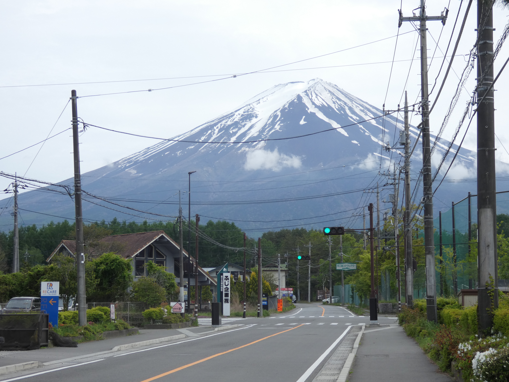

Aufgrund des Jetlags sind wir spät aufgestanden und haben erst gegen 12 Uhr das Haus verlassen. Wenn man aus dem Hotel kommt und sich nach rechts dreht, kann man direkt den Fuji sehen 😍. 

Wir sind sind in die Fuji-Richtung gewandert und haben Mittag in einem Koreanischen BBQ Restaurant gegessen. Gemüse und Garnelen haben wir selbst auf einem kleinen Holzkohlegrill, der im Tisch integriert ist, geröstet. Dazu gab es Bibimbap, ein Reisgericht mit verschiedenen Gemüsesorten und Gochujang (eine Chilipaste). 

Danach haben wir einige sehr schöne Aufnahmen vom Fuji gemacht, der auch mit Wolken verhangen und ohne Sonnenschein wunderschön aussieht 💗.

Auf unserem Rückweg sind wir an dem süßen Café und Galerie Couleurs vorbeigekommen, deren Besitzer super freundlich und nett sind. Es gibt sehr leckeren Kuchen (bspw. Zitronentarte und Orangenkuchen 😋) und Kaffee, sehr schöne Ausstellungsstücke und einen wunderbaren Blick auf den Fuji.
<!-- https://github.com/11ty/eleventy/issues/2301
[Café und Galerie Couleurs](https://g-couleurs.jp/index.html){target="_blank"}  -->

