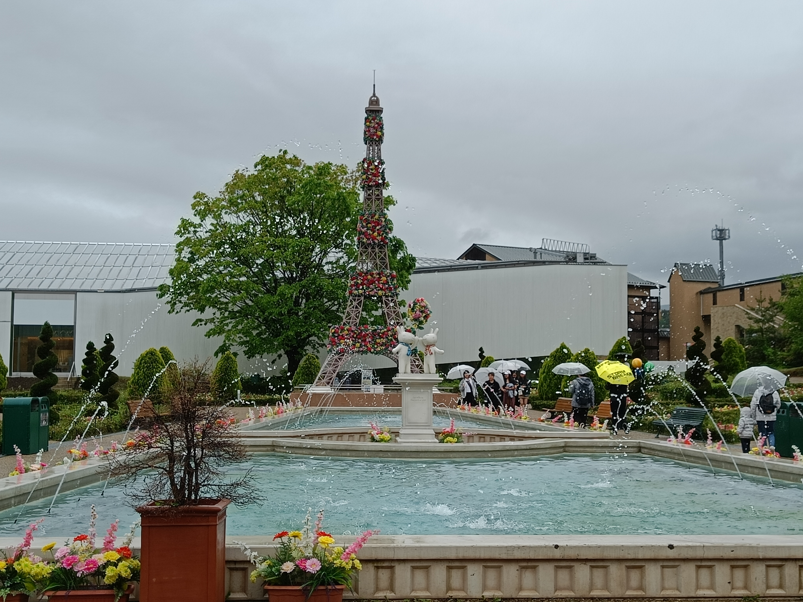
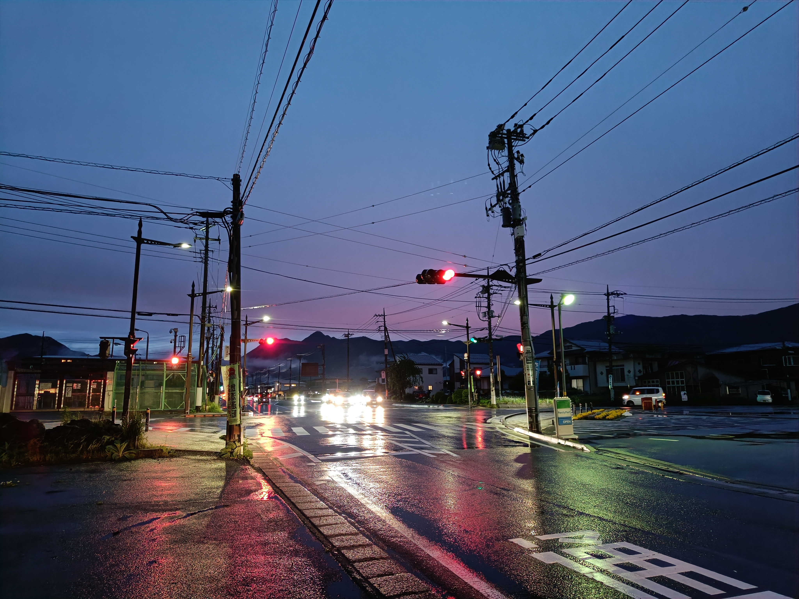

Heute hat es geregnet und Unternehmungen sind hier größtenteils für draußen gedacht. Deswegen sind wir zum Fuji-Q Highland gefahren. Fuji-Q Highland ist ein Vergnügungspark am Fuße des Fuji; so hat man beim Achterbahn- und Riesenradfahren eine herrlichen Blick auf den Fuji. Theoretisch zumindest; die Fahrgeschäfte waren auf Grund des Wetters nicht in Betrieb.
Direkt neben dem Park liegt das Fujiyama Museum. Es zeigt Werke moderner (ab ca.1850) und zeitgenössischer Künstler zum Fuji aus verschiedenen Blickwinkeln, zu verschiedenen Jahreszeiten, Tageszeiten, in verschiedenen Farbkombinationen usw. In einem Raum wurden auch einige der "36 Ansichten des Berges Fuji" von Katsushika Hokusai ausgestellt. Alle Bilder der Ausstellung sind einzigartig und wunderschön. Was alle Bilder gemeinsam haben, ist die beeindruckende Wirkung, die der Fuji jeweils hat. Er ist ein einsamer, ruhiger Gigant im Hintergrund, der über alles wacht, während um ihn herum die Zeit vergeht, Menschen geschäftig sind, sich die Jahreszeiten ändern, Leben vergeht. 

Nach dem Museumsbesuch sind wir noch ein wenig auf dem Gelände des Fuji-Q Highlands spaziert. Dort gibt es Restaurants, eine Menge von Souvenir-Shops, verschiedenen Themenwelten wie ein verstecktes Naruto/Boruto-Dorf, ein Lisa und Gaspard Dorf, ein "Thomas die Lokomotive"-Land und vieles mehr.  

Auf dem Rückweg zum Hotel gab es noch eine Möglichkeit für ein Bild bei Nacht mit hübschen Farben.

