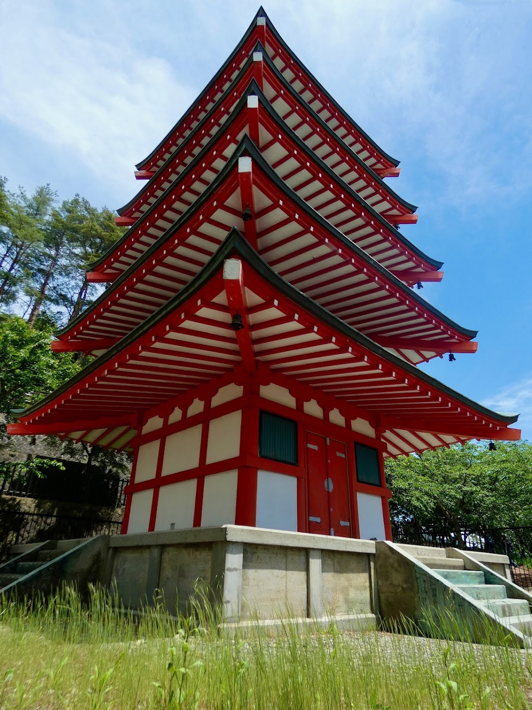

Die Chureito Pagode im Arakurayama Sengen Park stand heute auf dem Plan. Um dieses Postkarten-Motiv "Fuji-Chureito-Pagode" zu genießen, muss man einige Stufen hochklettern - genau genommen sind es 398; die Aussicht mit Fujiyoshida am Fuße des Fujis lohnt sich aber alle Mal. Wir waren heute wieder zeitig auf den Beinen und selbst so früh am Morgen waren schon sehr viele Touristen unterwegs. 
Der frühe Vogel muss nicht mit überfüllten Sehenswürdigkeiten kämpfen funktioniert hier scheinbar nicht. 😜

Auf der Aussichtsplattform selbst waren extrem viele Touristen versammelt, die ihr Postkartenmotiv bekommen wollten. Heutzutage ist es wohl angebrachter von Instagram-Pictures zu reden. 😆
Man hat das Gefühl, dass viele Touristen einfach nur schnell die berühmten Sehenswürdigkeiten, die sie von Instagram oder anderen Social Media Plattformen kennen, "abarbeiten", um ihr eigenes Foto für Instagram zu schießen und das dann posten zu können. Dabei scheinen sie  überhaupt nicht zu genießen, was sie sehen oder was um sie herum passiert. Hätte man die Leute auf der Plattform gefragt, was es mit der Pagode auf sich hat, hätte es wohl kaum einer gewusst.

Für interessierte Leser: Die fünfstöckige Pagode im Arakurayama-Sengen-Park steht am Berghang mit Blick auf die Stadt Fujiyoshida und dem Fuji in der Ferne. Sie ist Teil des Arakura-Sengen-Schreins und ein Neubau, der erst 1963 als Friedensdenkmal errichtet wurde, um den Bürgern von Fujiyoshida, die von der Mitte des 19. Jahrhunderts bis zum Zweiten Weltkrieg in Kriegen starben, zu gedenken.

Meine Kritik an den Touristen klingt wahrscheinlich sehr gemein und sehr kritisch. Man kann jedoch das respektlose und ignorante Verhalten gegenüber der Natur oder ihren Mitmenschen, auch gegenüber Sachgegenständen mancher Touristen beobachten.
Ein perfektes Beispiel ist die Aussichtsplattform bei der Pagoda - es sind drumherum Schilder aufgebaut, mit denen die angrenzenden Grasflächen geschützt werden sollen. Um das perfekte Bild der Pagode mit dem Fuji zu bekommen, ignorieren die Menschen die Schilder "Do not pass" (Durchgang verboten), klettern über die Absprerrungen und trampeln alles nieder.
In den Medien liest man immer häufiger über Touristen, die das Leben der Einheimischen erschweren und keinen Wert auf das Verständnis der Kultur und Tradition legen und damit das Japan-Erlebnis für alle Touristen verschlechtern. Beispiele dafür sind Lawson in Kawaguchiko oder das Geisha-Viertel in Kyoto und die Verschmutzung des Fuji mit Müll durch touristische Bergsteiger. 

Nach der Pagode haben wir noch das Freilichtmuseum "Saiko Iyashi-no-Sato Nenba" besucht. Saiko Iyashi-no-Sato Nenba ist ein Dorf mit rekontruierten, traditionellen strohgedeckten Häusern am Ufer des Saiko-Sees. Man hat von dort einen schönen Blick auf den Fuji.
Man kann z.B. regionales Obst und Gemüse, lokal gebrauten Sake und von lokalen Künstlern hergestelltes Kunsthandwerk kaufen.
Im Laufe unseres Aufenthalts haben sich die Wolken zugezogen, sodass es am Abend und in der Nacht ordentlich Regen gab. 

