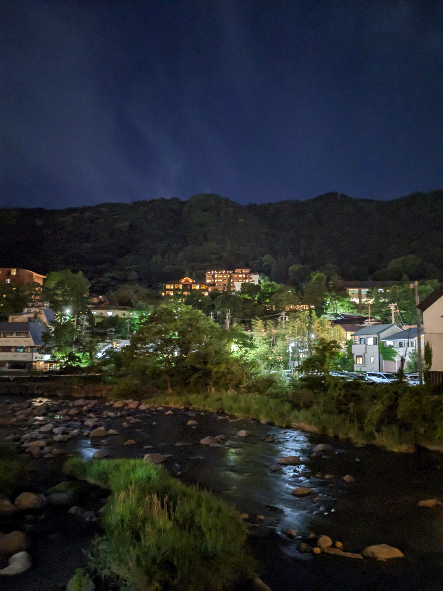

In Hakone haben wir ein schönes, großes, traditionelles Zimmer mit Tatami-Matten und Futons und einen hübschen Blick auf die Berge. Es gibt auch einen Gemeinschaftsraum mit einer Terrasse und super schönen Ausblick ins Grüne.

Wir sind heute etwas später aufgestanden, weil wir so geschafft von den letzten Tagen waren. Daher sind wir erst mittags aus dem Haus und mit dem Bus nach Moto-Hakone zum Ashi-See gefahren. Ursprünglich wollten wir entlang der Tōkaidō-Route wandern, das haben wir dann aber auf morgen früh verschoben. 
Der Fuji hat sich von seinen schönsten Seiten gezeigt und das Wetter war auch toll. Dieses Mal haben wir die alte Zedern-Allee gefunden, die sich mir beim letzen Mal nicht offenbart hatte. Die Zedern wurden auf Befehl des Shogunate gepflanzt, damit die Händler geschützt im Schatten ihre Wege zurücklegen konnten.

Danach haben wir uns den Hakone Checkpunkt angeschaut, den ich beim letzten Mal schon beschrieben hatte. Vom Aussichtspunkt konnten wir den Fuji sehen. 
Schließlich sind wir mit einem Piratenschiff über den Ashi-See geschippert, was ca. eine halbe Stunde gedauert hat. Da es nicht so teuer war, haben wir uns für die Überfahrt zu unserem Hakone FreePass ein Upgrade für die erste Klasse geholt und konnte im vorderen Teil des Schiffes mit wenigen anderen Touristen den Ausblick genießen. Das hat sich wirklich gelohnt. Die Berge um den See sehen ganz wunderbar aus; so viele verschiedene Grüntöne. 😍 

Mit der Seilbahn sind wir dann eine Weile unterwegs gewesen und habe uns den See von oben angeschaut, den Fuji gesehen und konnten die Berge genießen. Mit einem Zug sind wir dann zurück nach Hakone gekommen. 

Dort haben wir in einem italienischen Restaurant gegrilltes Gemüse und Pizza gegessen und konnten noch einige schöne Nachtaufnahmen von Hakone machen.

