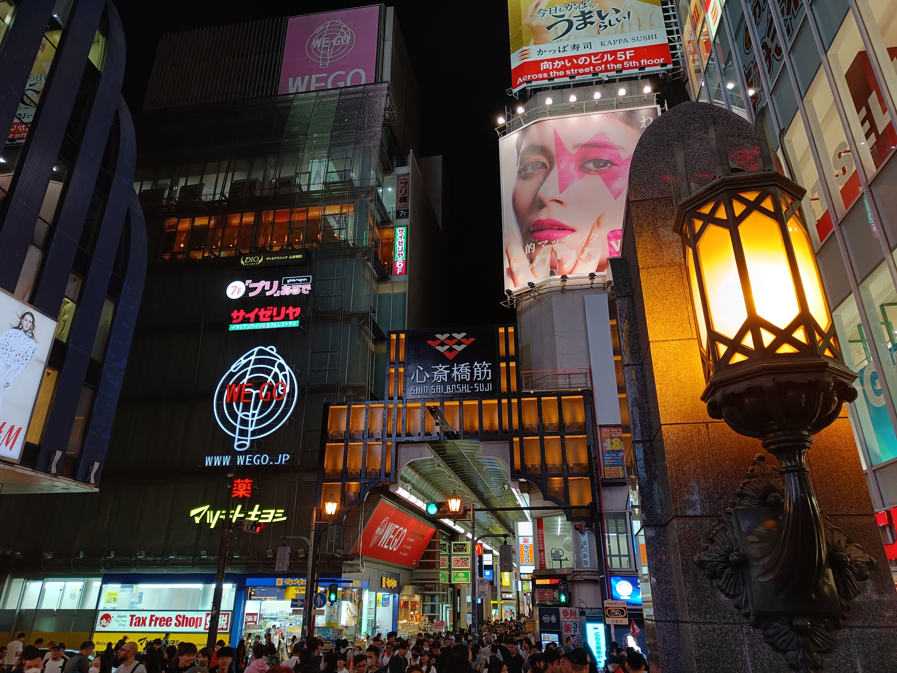
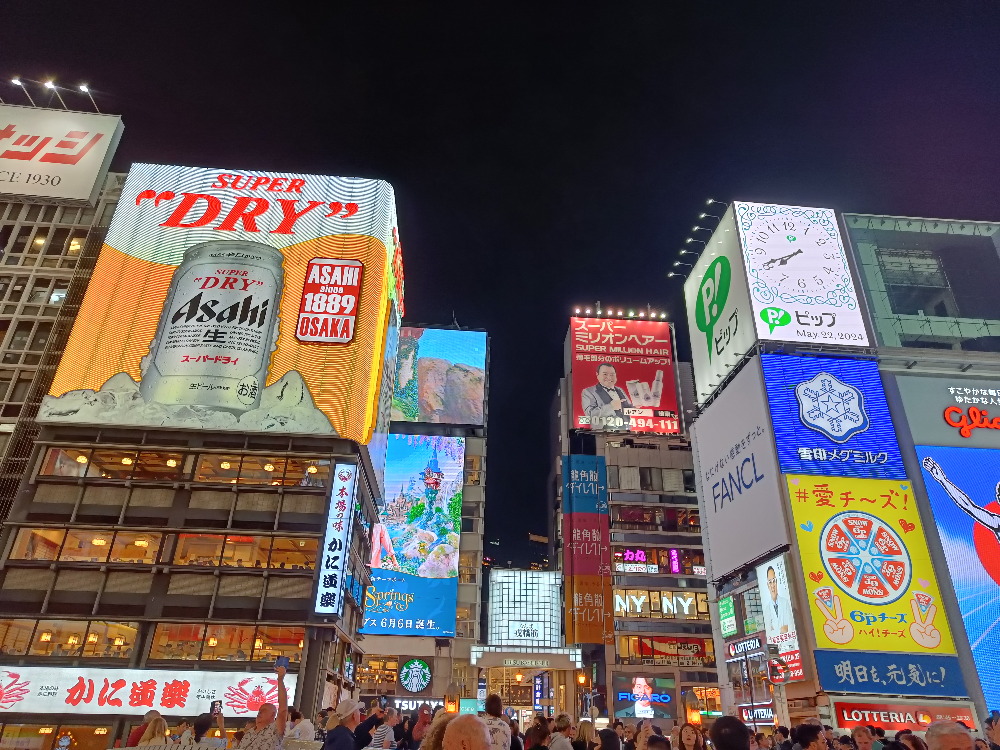

Heute sind wir nach Ōsaka gereist und haben uns am Abend den Bezirk Minami (bedeutet Süden) mit dem Namba Walk, Shinsaibashi und Dotonbori angeschaut.

Der Namba-Walk ist ein beliebtes unterirdisches und über 715 m langes Einkaufszentrum mit rund 270 Geschäften, die unter anderem Mode und Feinkost anbieten. In Japan sind unterirdische Einkaufszentren gar nicht so untypisch; es ist etwas gruselig daran zu denken, dass die Verkäufer ggf. selten Tageslicht sehen. 😳

Shinsaibashi ist ein ca. 600 m langes Einkaufszentrum mit hochwertigen Geschäften. Es verbindet (hochpreisigere) Einzelhandelsketten, trendige Boutiquen, teure Kaufhäuser und Top-Designer-Modemarken.

Eines der beliebtesten Touristenziele Ōsakas ist Dotonbori, da es ein buntes und belebtes Einkaufs- und Unterhaltungsviertel und für sein Street-Food bekannt ist. Nachts wird es von Hunderten von Neon- bzw. LED-Lichtern und mechanischen Schildern beleuchtet, darunter dem berühmten Glico-Laufmann (Glico running man), eines der bekanntesten Wahrzeichen Ōsakas. Das Schild stammt aus dem Jahr 1935 und leuchtet seit mehr als 80 Jahren über dem Dotonbori-Kanal. Der laufende Mann wirbt für Glico, den Hersteller eines der bekanntesten Süßwarenunternehmen Asiens. Glico vermarktet z.B. "Pocky", die mit Schokolade oder anderen Süßwaren überzogenen Gebäckstangen. In Deutschland werden sie übrigens unter der wahrscheinlich beim Leser bekannten Marke "Mikado" vetrieben; Glico als Hertseller wird auf der Verpackung auch genannt.

In meinem Post 2019 sind Shinsaibashi und Dotonbori schon einmal vorgekommen.
Es war wieder sehr viel los, aber die Beleuchtung bei Nacht ist auch einfach wirklich schön. 😍 

Auch beliebt sind die 10-Yen-Münzen aus Waffelteig gefüllt mit Käse oder Pudding. Wir haben beide probiert als sehr gut befunden ^^.

