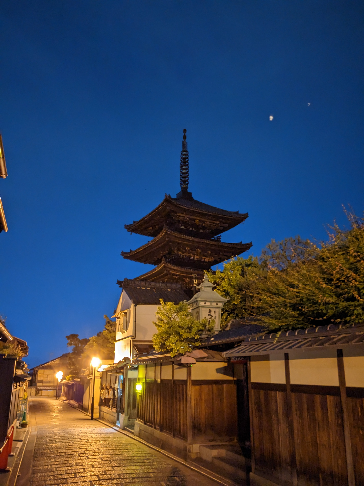
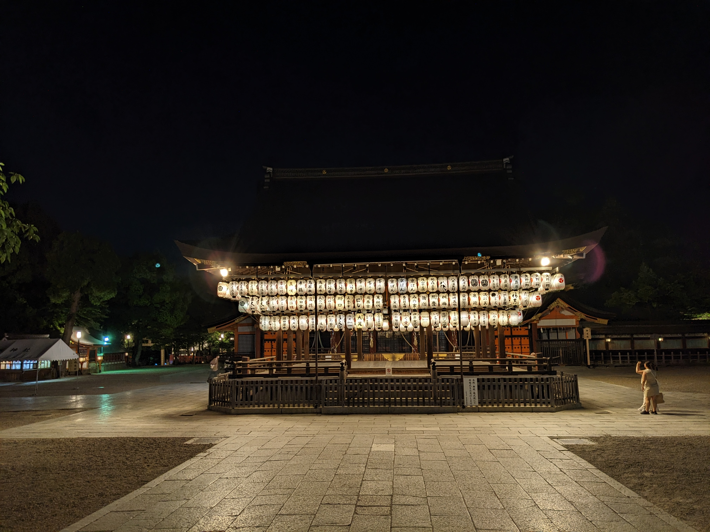
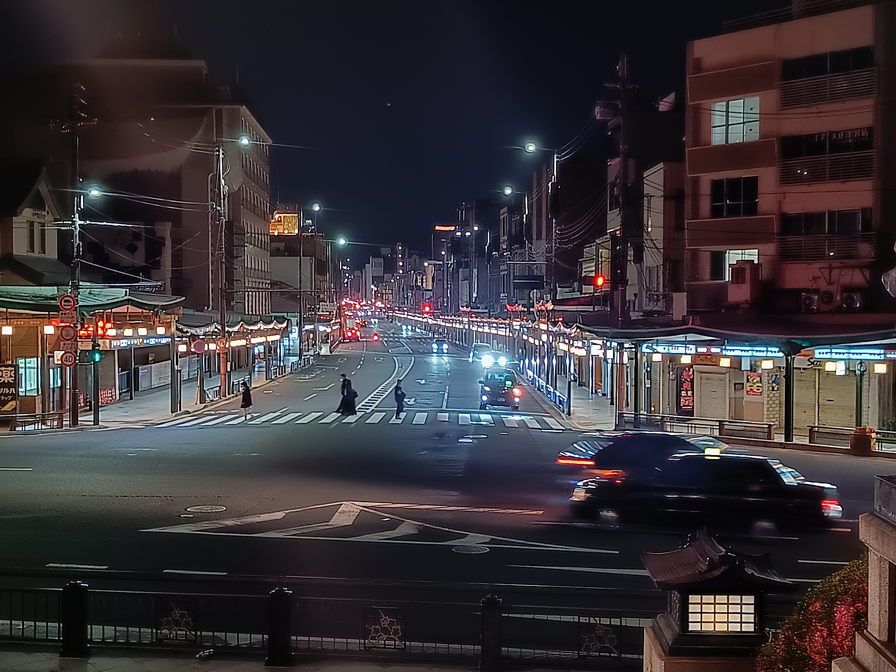

Den Fushimi Inari Schrein (auf Japanisch Taisha) hatte ich 2019 bei einer geführten Tour kennengelernt, bei der wir die Touristenpfade vermieden haben. Leider wird diese Tour nicht mehr angeboten, sodass wir uns durch den Touristenansturm quälen mussten. 😳

Der Schrein ist mit 10.000 Torii (Toren) sehr groß und um den Gipfel in 230 Meter Höhe zu erreichen sind 12.000 Stufen zu erklimmen. Es hat sich aber auf jeden Fall gelohnt und es war interessant, altbekannte Orte wiederzusehen und Veränderungen zu bemerken.

Hier ist auch der Beweis, dass wir es bis ganz nach oben geschafft haben. ^^

Am Abend sind wir dann noch ein wenig durch Kyōto flaniert, was sehr schön anzusehen war. 

