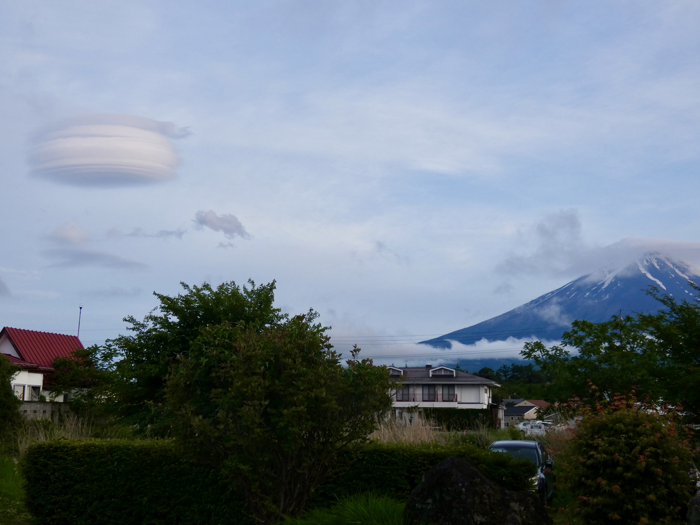

Eine gute Nachricht: Wir sind zurück in Kawaguchiko. Eigentlich war der Plan, längere Zeit in Kyōto zu bleiben. Da es aber so von Touristen wimmelt und es keinen Spaß macht, durch Sehenswürdigkeiten gepresst zu werden und mit ansehen zu müssen, wie ungehobelt und respektlos sich manche Leute verhalten, haben wir beschlossen, unsere Zeit lieber in Fujikawaguchigo zu verbringen.

Wir haben die Koffer auf die Reise geschickt und sind selbst mit dem Shinkansen nach Michima und danach mit dem Bus nach Fujikawaguchiko gefahren. Insgesamt waren wir ca. 4 Stunden unterwegs. Es hat heute den ganzen Tag geregnet; als wir jedoch fast in Fujikawaguchiko ankamen, hat sich die Wolkendecke gelichtet und wir hatten einen wundebaren Blick auf den Fuji. 😍 Als würde er sich freuen und uns begrüßen. 😁

<iframe width="560" height="315" src="https://www.youtube.com/embed/hBiOnDPS050?si=PZ_9Fv0mCv7_lCm6" title="YouTube video player" frameborder="0" allow="accelerometer; autoplay; clipboard-write; encrypted-media; gyroscope; picture-in-picture; web-share" referrerpolicy="strict-origin-when-cross-origin" allowfullscreen></iframe>

Unser Hostel hier ist auch super schön. Vom Zimmer aus haben wir direkten Blick auf den Fuji 😍. Als wir im Hostel ankamen, war das der Ausblick:

