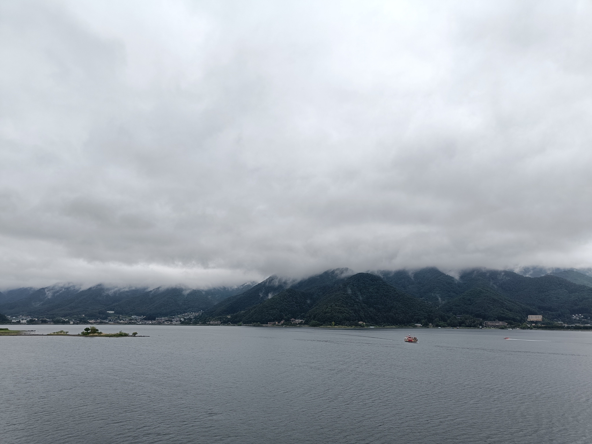

Ursprünglich war unser Plan für heute, noch einmal zum Freilichtmuseum Iyashi no Sato am Saiko zu fahren, weil wir beim letzten Mal erst spät dort ankamen und deswegen viele der Häuser nicht besuchen konnten. Aber es kam anders als gedacht. 😆 Wir haben den Bus verpasst. 😑 Das war aber auch komplett gerechtfertigt. 

Der Bus sollte von der Haltestelle "Kräuterhalle" aus losfahren und da wir noch Zeit hatten, haben wir uns den Souvenirshop in der Kräuterhalle angeschaut. Es gab auch einen Wintergarten, in dem man Tee trinken konnte (haben wir natürlich gemacht 😬). Deutlich vor der Abfahrtszeit standen wir an der Bushaltestelle, allerdings war die Beschilderung sehr verwirrend. 😯 Die grüne Buslinien bringt einen von der Kräuterhalle direkt zum Freilichtmuseum. In der Karte sind die beiden Stopps 5 und 6 und die Schleife, die der Bus fährt, gelb eingekreist. Wir standen an Stopp 5 und waren unsicher, ob der Bus zuerst 5 oder 6 abfährt, wenn er aus Richtung des Bahnhofs kommt. Unsere Vermutung war, dass er erst 5, dann 6 abfährt - hat er aber nicht: erst 6 dann 5. 😬 

Da der nächste Bus erst eine Stunde später gekommen wäre, haben wir unsere Pläne geändert.
Nicht weit von der Haltestelle ist die Kawaguchiko-Brücke, die einen schönen Blick auf den See bietet. Es war sehr wolkig, aber die Wolken sehen auch einfach immer ganz wunderbar aus. 😍

Später sind wir mit der Bahn zur Fuji Station gefahren und waren bei der Touristeninformation, wo wir Infos zu einer Wanderroute zur 5. Fuji-Station bekommen und uns sehr nett mit der Mitarbeiterin unterhalten haben.
In einem kleinen Café haben wir Mittag gegessen und Kaffee getrunken. Es war sehr gemütlich und gehört einem älteren Ehepaar. Der Mann bereitet die Getränke zu; für den Kaffee mahlt er die Bohnen mit einer Handmühle und filtert ihn mit einem alten Keramikfilter. Also läuft sehr bedächtig und ruhig ab und ist sehr entspannend. Eingerichtet ist das Café wie ein Wohnzimmer, mit einer Menge Erinnerungsstücke vergangener Reisen der Besitzer; es verbreitet eine sehr behagliche Atmosphäre.

Danach sind wir zum Elektronikladen Nojima gegangen und haben uns alle möglichen Elektronikgeräte angeschaut: Rechner, Waschmaschinen, Reiskocher, Ventilatoren; das war super spannend.

Neben dem Fuji Bahnhof gibt es ein Einkaufszentrum, in dem wir uns dann noch eine Zeit lang aufgehalten und uns japanische Waren angeschaut haben. Zum Hostel sind wir erst spät zurück gekommen, weswegen wir kein Frühstück mehr bestellen konnten. Daher sind wir zum Lawsen und haben dann gegessen.

# weil bspw. die Waschmaschinen meist Toplader
# und dann in dem netten Kaffee, von dem Akif immer erzählt hat; danach dann noch beim Elektronikladen und dann noch in dem Einkaufsladen (Supermakt, Einkaufspassage an der Station); 
# Nojima Electronic Store - Washing machine, Muji some cotton cloth sind zu spät ins Hostel gekommen, deswegen sind wir zu Lawson und haben dort unsere Regenschirme vergessen und Frühstück gekauft
# es hat geregnet und wir sind dann am Abend einfach zum Lawson und haben unsere Regenschirma dort vergessen
